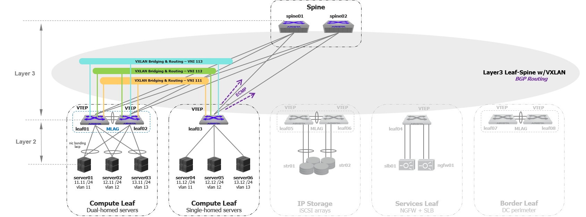

## Network Automation lab

Please note my lab is pretty much similar to LAB topolgy used in the link below.

https://the-bitmask.com/2017/07/11/arista-veos-l3slv-part1/

The above article which actually inspired me to design a lab using vEOS, VXLAN and KVM. Therefore Hats off to 
Pablo Narváez's who did a great job putting this article together making it possible for someone like me to exeriment
complex networking concepts in virtual environments.

    

For this lab, I created a self-contained virtual environment with CentOS Linux/KVM, vagrant and Arista virtual EOS (vEOS). 
Here I’m trying to address all of the technically challenges potentially we may experience when a network is deployed 
and built programmatically. I think building a network from the ground-up level programmatically is important as much as 
maintaining it programmatically. Thefore I spent considerable amount time on how to get the network built fast way with
a little human touch. Python is the programming language which I used as my base scripting and although I didn’t have much 
experience with Python and spent lot of time on Python coding and managed to suss out most of concepts including object 
oriented programming. 

virtual hosts used in my lab:
- Ansible host: vagrant-ubuntu-trusty-64
- Management host: CentOS Linux release 7.3.1611 (Core). 
  Services running on this host are DHCP and TFTP.
- L3 and L2 switches: Arista veos 4.17.8M   

This Network automation lab contains a number of playbooks which represent the following action.

## Table of Contents
* [Zero touch provisioning](*ZTP)
	
* [Validate LLDP neighbours](*validation)

* [Build topology](*topology)

## Zero Touch Provisioning
The actual automation of the building process is known as Zero Touch Provisioning (ZTP). Most major networking vendors have some 
form of ZTP support, and the process is pretty simple. There are a few specific configurations needed on the ZTP server to make 
everything work.

  + Generate config templates for SPINE and LEAF switches based on initial attributes define in host file.
  + Push the configuration templates to the TFTP server.
  + Update DHCP config entries for each network host using its Management interface’s MAC address with and restart DHCP server.
  + The network host in its initial boot downloads a python script from the TFTP server to and execute the given instructions in the script.
    This script checks it’s system MAC address and download the relevant configuration template to the host including the correct firmware.

## Validate LLDP neighbours

## Build topology 
- 
